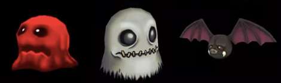
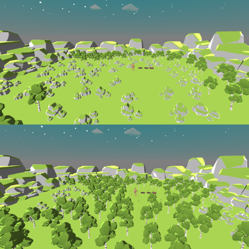
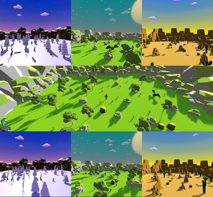
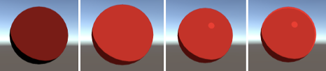
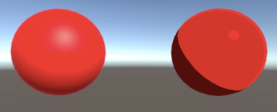
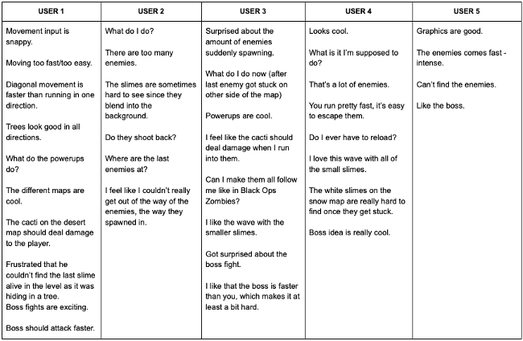
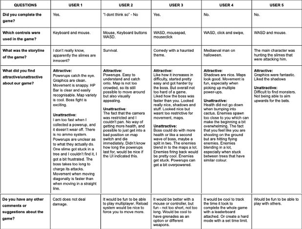

**The University of Melbourne**
# COMP30019 – Graphics and Interaction

## Teamwork plan/summary

<!-- [[StartTeamworkPlan]] PLEASE LEAVE THIS LINE UNTOUCHED -->
### Game plan

General plan below, though this does not mean team members will be strictly working in their given areas: 

* Lucas:  shading + procedural generation 
* Sebastian: sound design + Level design
* Yannick: modeling + character animation
* Jenny: character movement/interaction + AI

Report to be worked on by all members, with each member writing primarily about what they worked on.
We will be holding weekly retrospective team meetings. Here we will assess progress made from the last meeting and assign tasks for the upcoming week. 
Our main focus will be to complete the main game until the 16th of October and then introduce changes and updates based on
feedback after. Furthermore, time after the 16th will be allocated to write the final report. 

### Gameplay video

As the deadline for the gameplay video was pushed to the 18th of October, our initial gameplan was changed. Lucas and Yannick worked on the project the 
most in the early stages, creating the intital map design, procedual generation and other gameplay releated scripts. Jenny worked on creating a simple 
character alongside Lucas, however Lucas' solution were used. After this, Sebastian made the game play video and uploaded it within the deadline. 

### Final submission

After the gameplay video was submitted, our roles shifted. Lucas' main responsibility was to create the shaders, as the initial plan was. He also created 
particle systems and contributed to the wave management, enemy spawning and level switching code/unity scenes. Sebastians main responsibilty was no the 
wave management system, the boss fight, the scene switching interactions. He also created HUD notifications (text for new waves and collected power-ups)
and a main menu. Yannick's main task was to continue working on the maps, and update the procedural generation script. Jenny's responsibility was now the 
report and query. She was also helping on the coding when needed and requested. 

### Summary 

As a result of this project we have created a functioning game, that we are very proud of. In addition to the techincal skills, we have learned how to 
work in a team, and draw from eachothers strengths. 

<!-- [[EndTeamworkPlan]] PLEASE LEAVE THIS LINE UNTOUCHED -->

## Final report

“Slimey Business: The Slimeaggeddon” was developed as Project 2 for 30019 Graphics and Interactions at the University of Melbourne. It is a single-player,
top-down shooter created using C# in the Unity3D game engine. This report will summarise the game, including the information game’s storyline and core
mechanics. In addition, we will go into detail about our processes of creating the game, including, but not limited to, the design of the objects and
textures, the custom shaders, the procedural generation algorithm and the particle system implemented. Finally, we will also describe our querying and
observational testing methods and the changes made from the gathered feedback.

### Table of contents
* [Game Summary](#game-summary)
* [Technologies](#technologies)
* [Design](#design)
* [Graphics](#graphics)
* [Query and observational methods](#query-and-observational-methods)
* [Referencea](#references)

### Game Summary
The development of “Slimey Business: The Slimeaggeddon” started with deciding what type of game we wanted to make. Our final decision fell on a simple
shooting game, where the protagonist will fight against attacking monsters. 

The main storyline behind the game is simple; defend yourself to survive. The game starts with the player waking up in the middle of a forest, surrounded
by slimes and other evil creatures. The main character suffers from memory loss and cannot remember how he got there. Suddenly, the character feels as if
the gun wants to send him a message, a warning of danger in his surroundings. The character must pick up a weapon and defend himself to survive. The player
will experience waves of enemies with increasing difficulty. After he has defeated the enemies in the forest, the journey continues to the desert and a
winter land. Finally, the player must defeat the main boss to complete the game. 

The player has to control the movement using the WASD keys to control the main character. In addition, the mouse is used to aim while shooting with a left
click.

### Technologies
Project is created with:
* Unity 2022.1.9f1 
* Ipsum version: 2.33
* Ament library version: 999

### Design

#### CHARACTER AND ENEMY DEVELOPMENT

For the design and development of the main character, we chose to implement an asset from Unity Asset Store. To fit the low poly style of the game, we 
decided to use the “Low Poly Human - RPG Character” asset pack by Blink. The character came with pre-developed animations. For our game, the only 
implementation necessary was the animation “RunForward”. The model switches between the Idle and RunForward states to move around on the map.  The 
character also has a weapon object that has customisable fields, such as number of projectiles, fire rate, whether it is automatic and how much damage it 
deals.

The various enemies are taken from the “Level 1 Monster Pack” by PI Entertainment Limited on the Unity Asset Store (see references). We chose the slime, 
bat and ghost models from this pack to represent the enemies in-game. There are two types of enemy scripts, the basic enemy, which chases the player and 
the swooping enemy, which flies at the player at high speed every few seconds. 

  

#### OBJECTS, TEXTURES AND ENTITIES

We have created a low poly-style environment for our game. We made this choice based on our more simplistic idea for looks and efficiently fulfilling the
performance requirements. Therefore, we have used a variety of low poly assets from the Unity Asset Store as our primary game objects. We used these game
objects to create the map itself, the player model, power-ups, and enemy models. To further enhance this feeling, we based our textures and materials on
flat but glossy colours. This was also done to fit the aesthetics of our implemented cel shader, which is described in a later section. We tried using a
few more realistic textures, but they did not fit the low poly style, which made us revert to the plain colours. 

#### PROCEDURAL GENERATION

We employed two different algorithms to procedurally generate the playable area for the three of our different map types. What we wanted with these 
algorithms was to generate a new map each time a new game is played. Both algorithms were based on the idea of randomly scattering enemies and power-ups 
as well as objects like trees, rocks and grass or handmade tiles to build a map.

The first algorithm we implemented scattered a gameobjects based on a grayscale value from perlin noise. The benefit of this algorithm was that it gave us 
more control over the final design of the map and allowed us to completely remove the chance of generating a faulty map. Yet the maps we generated often 
gave us unappealing results, so we decided to switch our approach and change the algorithm.

  

As can be seen in Figure 4, scattering our handmade tiles creates a more repetitive looking environment. Although a limited amount of tiles also 
contributes to this look. 

The algorithm we chose to use randomly generates rays in a predefined area and instantiates a random prefab from a given array on the point of 
intersection between ground plane and ray. To avoid intersections between previously instantiated objects and the initial player position we make sure to 
only instantiate the object if no collisions occur. Choosing a reasonable amount of gameobjects to be scattered also ensures that the perceived impact of 
one object being deleted due to collisions is very small. This algorithm instantiates scattered trees, rocks, bushes, grass, enemies and power-ups at 
random locations throughout the map.

  

It is worth mentioning that the map borders are not part of the procedurally generated area. These were handcrafted to avoid ugly-looking or even faulty 
borders that would allow the player to get outside of the intended playing field.

#### IMPACT ON GAMEPLAY

The procedural generation of trees, power-ups and enemies keeps the gameplay fresh during every playthrough. No levels are ever the same. However, we
decided to keep a few consistent levels; for example, level 2.2 will only spawn many tiny slimes in random positions around the map, and level 2.3 will
only spawn bats. This provided more order without the waves becoming stale and repetitive.

### Graphics 

#### Shaders

The first and most impactful shader we created was our cel shader (CelShader(Texture/Color)), which applied to almost every single material in the game.
The shader calculates the level of diffuse lighting on a pixel. It then restricts it so that anything above a specific brightness level has a constant
value and anything below the level has zero brightness. This results in flat-looking lighting where a pixel is either in shadow or lit with no range
between the two. A flat ambient light value is added to the pixel's brightness, along with similarly restricted specular lighting using the Blinn Phong
model and rim lighting on lit pixels near the edge of objects.

  

Flattening each pixel's brightness results in a cartoony, almost 2D look as objects are rendered in sections of uniform colour rather than the smooth
range of colours seen in most lighting models (see figure x). This cartoon style meshed well with our plain colour and low poly assets to create a simple
and clean aesthetic for our game.

  

The other shader we created was our power-up shader (PowerUp), which we used to draw attention and give importance to the various power-ups scattered
around each map. The first component of our shader causes power-ups to expand and contract over time by multiplying each vector in a given object by the
sine function of time passed.

The second component of our powerup shader then applies a plasma effect to each pixel of a power-up by taking a secondary noise texture and offsetting it
based on the time passed. This noise texture determines the plasma colour's contribution to each pixel's overall colour - the plasma colour itself to
different values for each type of power-up by the PowerupColour script. Custom shaders can be found at project-2-tony-pizza/Assets/Shaders.

#### Particle systems

The primary (marked) particle system we created for our game is for enemy deaths (EnemyDeathAngled). We wanted to provide interesting visual feedback
rather than having enemies disappear on death and make it more satisfying for the player to defeat enemies.

Upon creation, our particle system emits a single burst of particles that slowly shrink over the next second. The particles have been given a 3D cube
render, collision and gravity. The HealthManager rotates them to fly in the direction of the killing bullet to make them appear like parts of the enemy
that have exploded upon death, bouncing off other enemies and surrounding objects. We then added short trails and some rotation to give the particles a
more explosive feel, resulting in an impactful enemy-death effect.

The other particle system we created was used to emphasise picking up power-ups and shooting out different coloured particles depending on the type of
powerup picked up. All particle systems can be found at project-2-tony-pizza/Assets/ParticleEffects.

### Query and observational methods

A requirement for this project was to include at least one querying technique. Our solution was to have the users play the game while implementing the
Think Aloud observational method. After the user has finished the game, we will perform an interview based on a mixture of open and closed questions. We
chose these methods, as the results will be easy to interpret and compare, without restricting the depth of the results.  

Our main focus with this query will be the game’s usability, as it will provide us with information about the playability of the game. The target audience
for this query will be teenagers/young adults, who play video games regularly. The person will not have any knowledge about the game beforehand, in order
to give an honest and unbiased evaluation of the game. 

#### Think aloud

With this technique, the user will play the game once. He or she will start the game and play it through until they win, or their character dies, without
any input from the interviewer. While they are playing, the user should vocalise their thoughts, which will be noted by the interviewer. These notes will
be written in section Results.

#### Interview 

As the user has completed the game, they will be asked the five questions below:

1. Did you complete the game?
2. Which controls were used in the game?
3. What was the storyline of the game?
4. What did you find attractive/unattractive about our game? 
5. Do you have any other comments or suggestions about the game?

#### Results

##### Think Aloud

  

##### Interview

  

#### Analysis of the result 

The overall feedback was positive based on the results obtained during the observation method ‘Think Aloud’ and the interview. The design of the game was
specially complimented. It also revealed that the users were familiar with the controllers used in the game. With the difficulty of the game, we received
mixed feedback. Some users could complete the game on the first try, while others did not. This may be a result of different skill levels when it comes to
experience with playing video games. However, as our target group were teenagers/young adults who play video games regularly, the results could implicate
that the game has a moderate difficulty level.

The query also revealed factors that need further attention. One of these issues was the spawning of enemies and their ability to get stuck inside the
terrain. The enemies also received feedback about being too similar to their surroundings in colour, which made them harder to spot. Regarding the main
character, we received comments about the difference in movement speed. Another main point in the feedback was the confusion about the game’s storyline
and the lack of updates during the game. 

After the result gained from the query on Saturday, 29th of October, we implemented changes based on the feedback. These changes included improving the
monster AI and spawning so they do not get stuck inside the terrain. Another change that was implemented was the movement of the character. It will now
move at the same rate in all directions. To make the game more understandable and exciting, we also implemented sound effects and text to tell the player
what power-up they picked up.

For further development, our main wish would be to make the game more interpretable and the storyline easier to understand. We would also like to allow
the player to change weapons and create a reload system.
